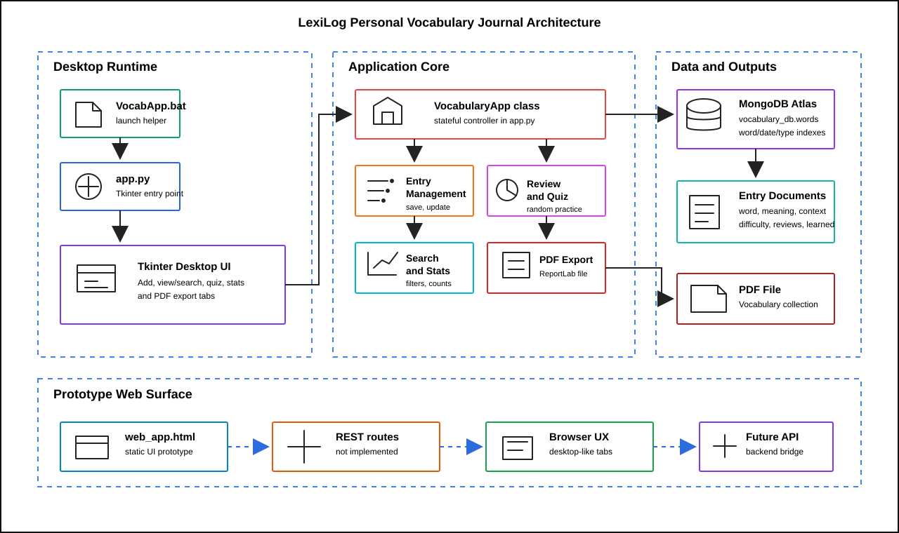

# LexiLog - Your Personal Vocabulary Journal

> A desktop vocabulary journal for capturing memorable words, phrases, and idioms from movies, then turning them into searchable notes, quiz practice, learning stats, and printable PDFs.

[](https://www.python.org/)
[](https://www.mongodb.com/)
[](https://docs.python.org/3/library/tkinter.html)
[](#license)

**[Features](#features) · [Quick Start](#quick-start) · [Usage](#how-to-use) · [Troubleshooting](#troubleshooting)**

---

## Table of Contents

- [Overview](#overview)
- [Features](#features)
- [Architecture](#architecture)
- [Project Structure](#project-structure)
- [Quick Start](#quick-start)
- [Getting Started](#getting-started)
- [How to Use](#how-to-use)
- [Data Model](#data-model)
- [Troubleshooting](#troubleshooting)
- [Roadmap Ideas](#roadmap-ideas)
- [Tech Stack](#tech-stack)
- [License](#license)

---

## Overview

LexiLog helps movie lovers build vocabulary from real viewing moments. When a dialogue line, subtitle, or idiom stands out, you can save it with its meaning, source movie, context sentence, difficulty level, and review progress.

The working application is the Tkinter desktop app in `app.py`. The repository also includes `templates/web_app.html` as a static browser UI prototype; the API routes referenced by that prototype are not currently implemented in the Python app.

## At a Glance

| Area | What LexiLog Does |
|---|---|
| Capture | Save words, phrases, and idioms with meaning, movie source, context, and difficulty. |
| Review | Quiz yourself on unlearned entries and update review progress as you practice. |
| Explore | Search, filter, and inspect your vocabulary collection from a tabbed desktop interface. |
| Reflect | View learning statistics by type, difficulty, review count, and source movie. |
| Export | Generate a formatted PDF collection for offline revision or printing. |

---

## Features

- **Entry management** - Add, update, view, search, filter, and delete vocabulary entries.
- **Flexible entry types** - Organize content as words, phrases, or idioms.
- **Movie-based context** - Keep the original source movie and sentence context beside each meaning.
- **Difficulty tracking** - Mark entries as Easy, Medium, or Hard to guide review priority.
- **Interactive quiz mode** - Practice unlearned entries, reveal answers, and mark what you know.
- **Learning statistics** - Monitor totals, learned counts, difficulty breakdowns, most-reviewed entries, and movie-wise counts.
- **PDF export** - Generate a printable vocabulary collection with ReportLab.
- **MongoDB persistence** - Store entries in a MongoDB `vocabulary_db.words` collection.
- **Static web prototype** - Preview the browser UI draft in `templates/web_app.html`.

---

## Architecture



---

## Data Flow

1. The user starts the app through `VocabApp.bat` or by running `app.py`.
2. The Tkinter tabs call methods on the `VocabularyApp` controller.
3. Entries are saved, searched, updated, deleted, and counted in MongoDB.
4. Quiz and review actions update review counters and learned status.
5. PDF export reads selected entries and renders a vocabulary collection file.

---

## Project Structure

```text
LexiLog/
|-- app.py                    # Main Tkinter app, MongoDB logic, quiz/stats, PDF export
|-- VocabApp.bat              # Windows launcher
|-- assets/
|   `-- architecture.svg      # README architecture diagram
|-- templates/
|   `-- web_app.html          # Static browser UI prototype
`-- .vscode/
    `-- launch.json           # VS Code debug config
```

---

## Requirements

- Python 3.8 or newer
- MongoDB Atlas account or local MongoDB instance
- `pip` for installing Python packages
- Windows is the smoothest path because the repo includes `VocabApp.bat`, but the Python script can run anywhere Tkinter is available.

Install the required packages with:

```bash
pip install pymongo reportlab
```

## Quick Start

If Python and MongoDB are already available, the shortest setup path is:

```bash
git clone https://github.com/ParthrChandurkar/LexiLog-Your-Personal-Vocabulary-Journal.git
cd LexiLog-Your-Personal-Vocabulary-Journal
python -m venv .venv
```

Activate the environment and install the dependencies:

```powershell
# Windows PowerShell
.\.venv\Scripts\Activate.ps1
pip install pymongo reportlab
python app.py
```

```bash
# macOS/Linux
source .venv/bin/activate
pip install pymongo reportlab
python app.py
```

Before launching, replace the MongoDB connection URI in `app.py` with your own URI. See the full setup below if you still need to create or configure a database.

---

## Getting Started

### 1. Clone the project

```bash
git clone https://github.com/ParthrChandurkar/LexiLog-Your-Personal-Vocabulary-Journal.git
cd LexiLog-Your-Personal-Vocabulary-Journal
```

### 2. Create a virtual environment

Windows PowerShell:

```powershell
python -m venv .venv
.\.venv\Scripts\Activate.ps1
pip install pymongo reportlab
```

macOS/Linux:

```bash
python -m venv .venv
source .venv/bin/activate
pip install pymongo reportlab
```

### 3. Configure MongoDB

In `app.py`, update the connection string with your own MongoDB URI:

```python
self.client = pymongo.MongoClient("your-mongodb-connection-string")
```

LexiLog stores data in:

```text
Database:   vocabulary_db
Collection: words
```

Keep private database credentials out of public commits. For production-style cleanup, move the URI to an environment variable before sharing the project broadly.

### 4. Run the desktop app

Windows:

```text
Double-click VocabApp.bat
```

Terminal:

```bash
python app.py
```

### 5. Preview the web prototype

Open `templates/web_app.html` in a browser to inspect the static UI concept. It needs matching backend API routes before it can work as a live web app.

---

## How to Use

### Add a vocabulary entry

1. Open the **Add Entry** tab.
2. Choose the entry type: Word, Phrase, or Idiom.
3. Add the meaning, movie name, context sentence, and difficulty.
4. Save the entry. If the same entry already exists, LexiLog can update it instead of duplicating it.

### Review your collection

1. Open the **View All** tab to see saved entries sorted by newest first.
2. Use search to find entries by word, meaning, or movie.
3. Use the type filter to focus on words, phrases, or idioms.
4. Double-click an entry to inspect the full meaning and context.

### Practice and export

1. Open **Quiz Mode** to practice entries that are not marked as learned.
2. Reveal answers when needed, then mark whether you knew the entry.
3. Use **Statistics** to review totals, learned entries, difficulty spread, review counts, and movie-wise activity.
4. Use **Export PDF** to create a printable vocabulary collection.

---

## Data Model

Each saved vocabulary item is stored as a MongoDB document with fields like:

| Field | Purpose |
|---|---|
| `word` | Lowercase word, phrase, or idiom used as the entry label. |
| `meaning` | Definition or explanation added by the user. |
| `movie` | Source movie where the entry was found. |
| `context` | Dialogue line, subtitle, or sentence where the entry appeared. |
| `difficulty` | User-selected level: Easy, Medium, or Hard. |
| `entry_type` | Category: Word, Phrase, or Idiom. |
| `date_added` | Timestamp created when the entry is first saved. |
| `review_count` | Number of times the entry has been updated or reviewed in quiz mode. |
| `learned` | Boolean flag used to keep learned entries out of future quiz rounds. |

---

## Troubleshooting

| Problem | What to Check |
|---|---|
| MongoDB connection error | Confirm your URI, username, password, IP access list, and database network access. |
| `ModuleNotFoundError` | Activate the virtual environment and run `pip install pymongo reportlab`. |
| Tkinter window does not open | Make sure your Python installation includes Tkinter support. On Windows, the standard Python installer usually includes it. |
| PDF export fails | Choose a folder where you have write permission and close any existing PDF with the same filename. |
| Web prototype buttons do not save data | `templates/web_app.html` is currently a static UI prototype and needs backend API routes to become functional. |

---

## Roadmap Ideas

- Move the MongoDB URI to an environment variable.
- Add a `requirements.txt` file for one-command dependency installation.
- Add automated tests around search, quiz updates, and PDF export helpers.
- Build backend API routes for the static web prototype.
- Add CSV import/export for easier migration between devices.
- Add screenshots or GIFs of the desktop workflow.

---

## Tech Stack

| Layer | Technology |
|---|---|
| Desktop GUI | Python, Tkinter |
| App Logic | Python `VocabularyApp` class |
| Prototype Web UI | HTML, CSS, JavaScript |
| Database | MongoDB Atlas |
| PDF Export | ReportLab |

---

## License

MIT License - free to use, modify, and share.
